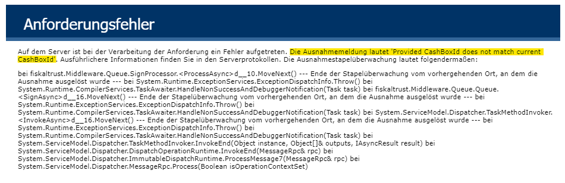

## Question
Exceptions or errors occur when I am sending requests to the fiskaltrust Middleware. How can I get additional debug information about what is failing?

## Metadata tags
lang-en, market-de, middleware, PosCreator

## Answer
Depending on the communication type and the language you are using, you have different options about how to retrieve more detailed error messages. We recommend the following steps:

### Inspect the request result

#### HTTP & SOAP
When using HTTP/REST or WCF/SOAP, the error message of the request should already contain useful information, like e.g. in the following screenshot:


Since the error message is returned as HTML document, it can be helpful to test a failing request via [Postman](https://www.postman.com/) (which supports the rendering results).

#### gRPC
If an error occurs in a gRPC request, the Middleware returns detailed information (like the error message, error details, and even the stacktrace) in the gRPC trailer metadata. 

How this metadata can be read strongly depends on the platform/programming language you are using. 

For example, in C# the metadata can be read like this:

```cs
try 
{
    await pos.SignAsync(nonWorkingRequest);
}
catch (RpcException ex)
{
    foreach (var entry in ex.Trailers)
    {
        // Metadata is structured in key/value pairs
        Console.Error.WriteLine($"[{entry.Key}] {entry.Value}");
    }
}

// Example output:
// [exception-message] The XYZ cloud TSE could not connect to the internet; a timeout occured
// [exception-type] TseSpecificClientError
// [origin] fiskaltrust.Middleware.SCU.DE.SomeTse, Version=1.3.1.0
// ....
```

### Change the logging verbosity
By default, the fiskaltrust Launcher logs only messages on informational level and above. To easily enable debug logging (and optionally include logging to an output file as well), use the following parameters:
```cmd
fiskaltrust.exe -cashboxid=XYZ -accesstoken=XYZ -verbosity=Debug -logfile=myfile.log
```

This will, among many other messages, enable logging the following information:
- In- and outgoing requests of gRPC requests, including their content (in JSON)
- TSE lifecycle events and timing information (e.g. when a self test is executed)

**Please do not use debug logging in production scenarios**, as it might significantly impact the performance of the Middleware.
