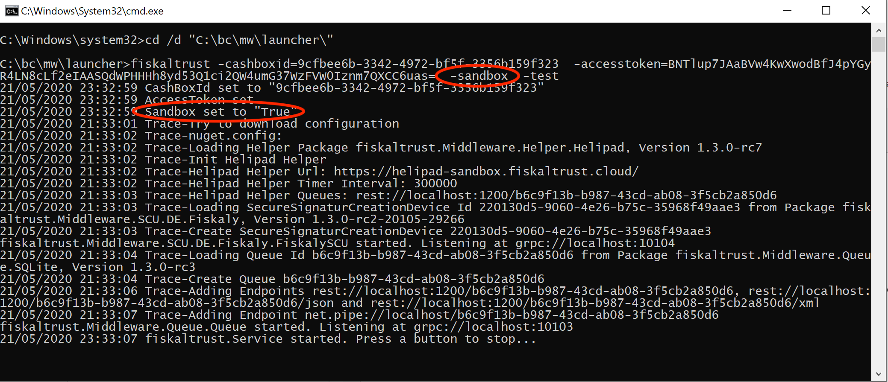

## Question
Does fiskaltrust offer a test system?

## Question
How can I test my cash register integration?

## Question
How can I test my implementation?

## Question
What is the fiskaltrust sandbox?

## Metadata tags
lang-en, market-de, middleware

## Answer

We offer a test system called sandbox. The sandbox is fully functional just like our live system. Depending on the country, it can be reached via the following URL:

- Germany: https://portal-sandbox.fiskaltrust.de

In the sandbox portal you can register your company just like you would in our live system. The difference is: It’s only for trying out the functions of the fiskaltrust.Portal and fiskaltrust.Middleware without any legal obligations.

In the portal you can configure a cashbox for testing. When you start it on your local machine, it will show you that it operates in sandbox mode:

[Here](../examples/js-rest-sign-call.md) you can find a JS/jQuery example calling the REST Web Service.

