## Question

Comment créer le produit ChaîneLocale ?

## Metadata tags

lang-fr, market-fr, middleware, PosCreator, PosDealer, PosOperator, Consultant

## Answer

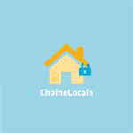

Le produit ChaîneLocale permet l'utilisation du fiskaltrust.Middleware sur un POS-System avec une installation locale. Ce produit est gratuit et peut être créé à tout moment via le [fiskaltrust.Portal] (https://portal.fiskaltrust.fr/). Plusieurs conditions doivent être remplies préalablement.

### Exigences

Inscrivez-vous en tant que revendeur (PosDealer) sur le [fiskaltrust.Portal] (https://portal.fiskaltrust.fr/).

#### Activer l'utilisateur de caisse (PosOperator)

Ouvrez le menu _PosOperator_ et la page _Vue d'ensemble_ puis cliquez sur la loupe dans le premier widget.

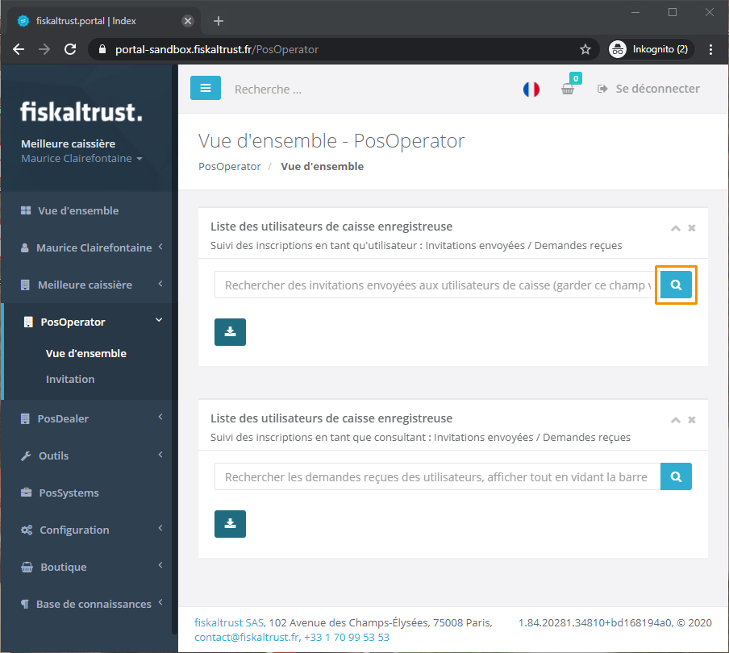

Cliquez sur le nom du PosOperator correspondant dans la première colonne pour activer le compte du PosOperator.

#### Entrer le SIREN et le nom de l'entreprise

Tout d'abord, un SIREN valide doit être saisi et vérifié dans les données de base de l'entreprise. Pour ce faire, vous devez compléter les données de base de l'entreprise.

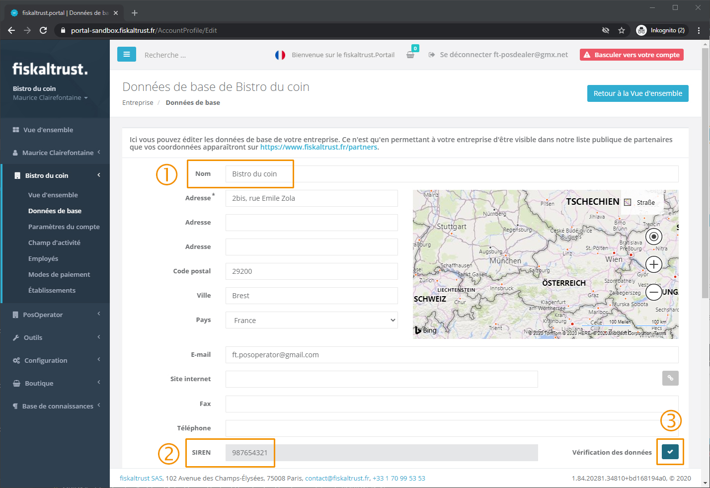

Inscrivez la raison sociale telle qu'elle figure dans le registre du commerce dans le champs **1**. Dans le champs **2**, entrez le SIREN de l'entreprise. (En mode "Sandbox", n'importe quel numéro à 9 chiffres peut être utilisé, par exemple 987654321). Cliquez ensuite sur le bouton de contrôle **3** pour comparer le SIREN avec le registre du commerce. Enregistrez les données à l'aide du bouton situé en bas de la fenêtre.

#### Ajouter des établissement et le SIRET

Cliquez sur le sous-menu _Outlets_ à la fin du menu _Nom d'entreprise_ pour afficher la liste des établissement (points de vente).

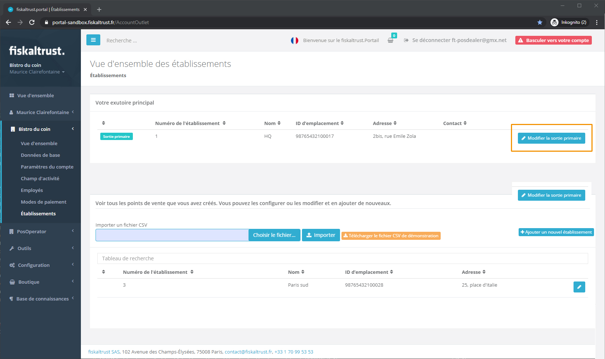

Le premier établissement est toujours le siège social de l'entreprise, tous les autres peuvent être ajoutées. Depuis cette page, vous pouvez modifier les établissements existants ou en créer de nouveaux.

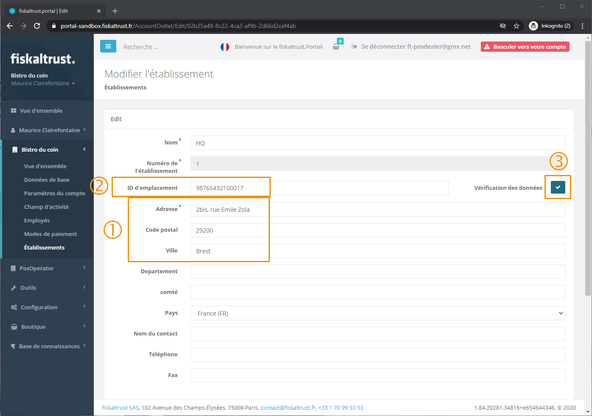

Veuillez entrer l'adresse **1** de l'établissement puis le SIRET de l'entreprise dans le champ _Location Id_ **2** (Dans l'environnement test "sandbox", n'importe quel numéro à 14 chiffres peut être utilisé, par exemple 98765432100012. Toutefois, les 9 premiers chiffres doivent correspondre au SIREN utilisé). Vérifiez ensuite le SIRET avec le bouton situé sur le côté droit **3** et sauvegardez les données avec le bouton en bas de la fenêtre.

### Créer une unité de création de signature (SCU)

Le dispositif de création de signature est la base de la sécurité et de l'inaltérabilité des données. Une fois créé, il ne peut être supprimé. Il s'agit d'un élément de base de la configuration du fiskaltrust.Middleware. Ouvrez la page _SCU_ dans le menu _Configuration_.

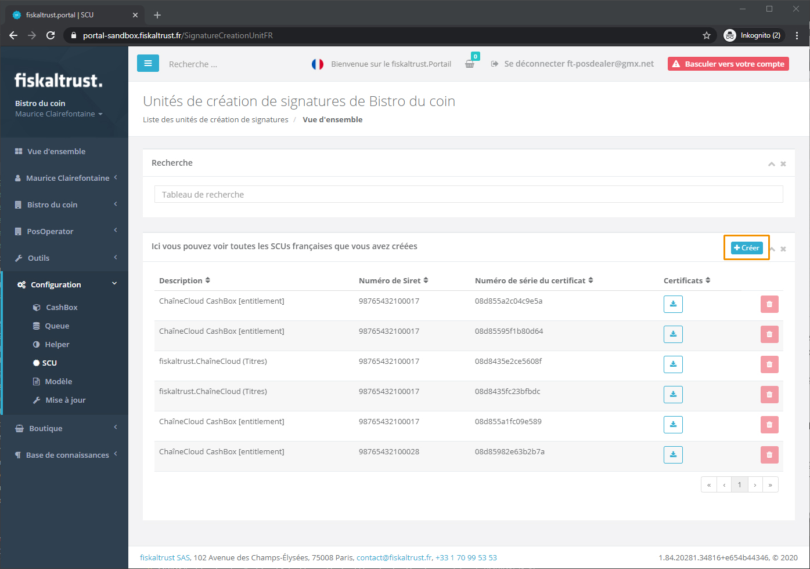

Cliquez sur le bouton _Créer_ pour créer une nouvelle SCU. Vous n'avez besoin que d'une seule unité de création de signature par point de vente. Celle-ci peut être utilisée pour plusieurs CashBox.

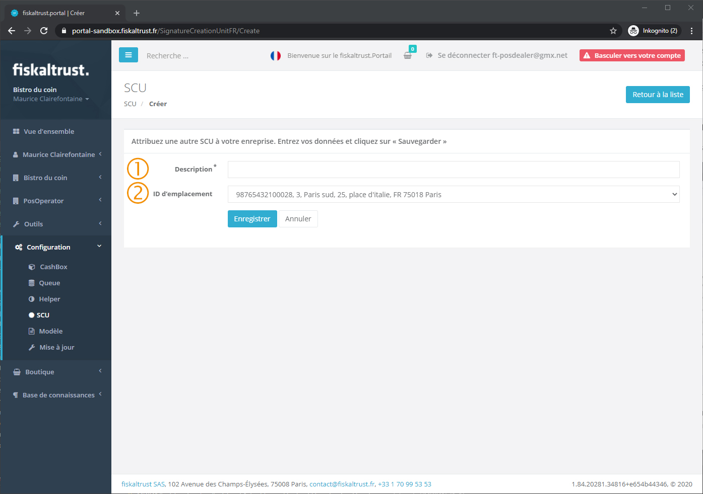

Entrez une description **1** pour la SCU et sélectionnez ensuite l'établissement **2** à lier à cette unité de création de signature.
Sauvegardez les données saisies avec le bouton _Enregister_ en bas de la fenêtre.

### Créer une Queue

La queue est le lieu de stockage de tous les documents dans un établissement. Elle peut être créée et gérée dans le menu _Configuration_.

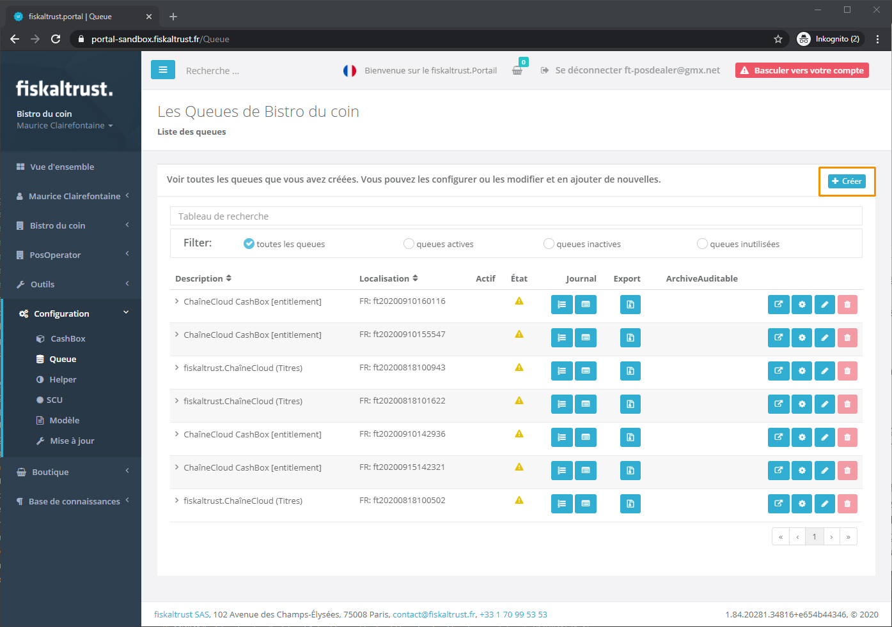

Créez une nouvelle Queue avec le bouton _Créer_. Il faut au moins une queue par établissement. Elle peut gérer jusqu'à 10 POS-Systems. Pour ce faire, elle doit être accessible à partir de chaque POS-System de l'établissmeent individuellement.

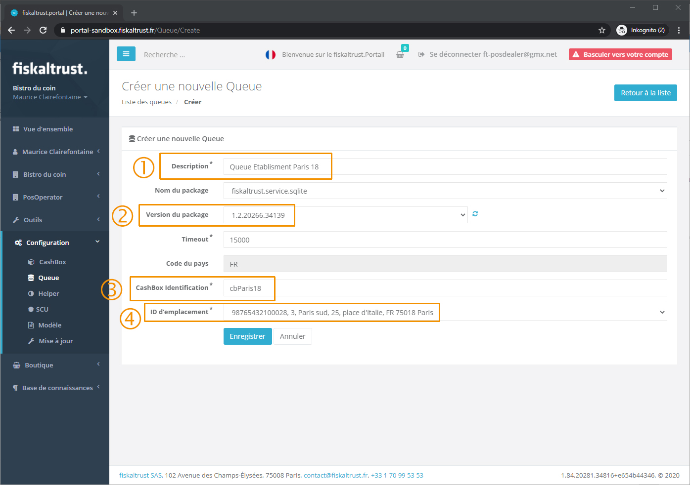

Complétez les champs dans cette fenêtre. La description **1** est uniquement destinée à vous aider à identifier la queue. Le numéro de version **2** doit être sélectionné correctement pour être conforme à la loi. L'identification de la CashBox **3** doit être unique pour chaque compte et est utilisée comme identification interne. Avant d'enregistrer, sélectionnez l'établissement approprié.

**Lorsque vous choisissez un établissement, assurez-vous de toujours utiliser le bon et toujours le même. Cela ne peut pas être modifié par la suite !**

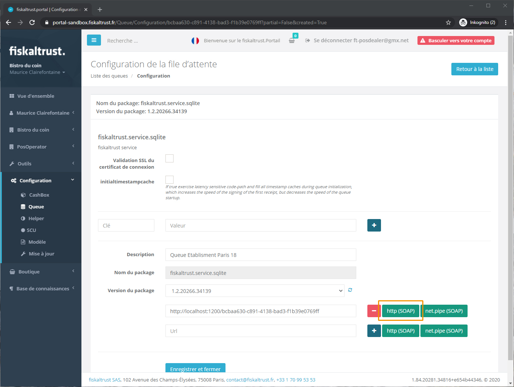

Enregistrez cette configuration et ajoutez une http-URL dans la fenêtre suivante sans modifier aucune des autres valeurs puis sauvegardez la configuration.

### Affecter la SCU à la Queue

Pour assurer la sécurité des documents stockés dans la queue, l'unité de création de signature doit être connectée à la queue.

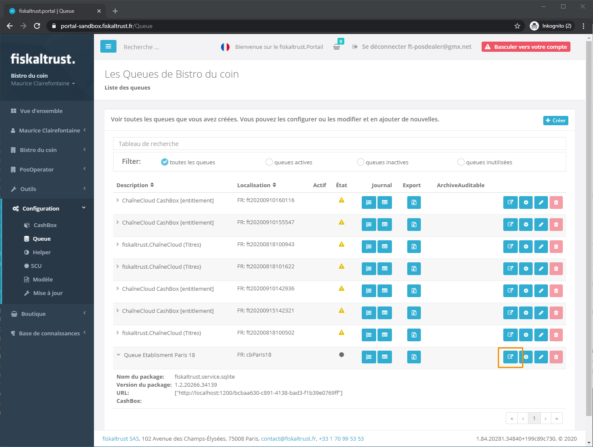

Trouvez la queue récemment créée dans la liste. Il y a quatre boutons de configuration sur le côté droit. Cliquez sur le premier (le rectangle avec la flèche).

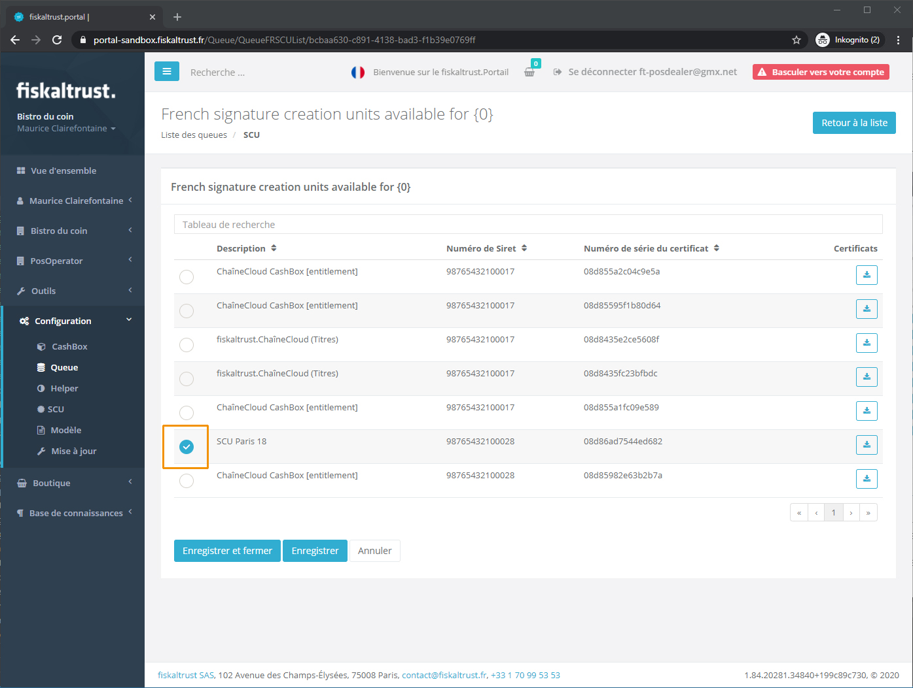

Sélectionnez la SCU que vous avez créé lors de la première étape et cliquez sur _Enregistrer et Fermer_.

**Attention à cette étape, la SCU de cette queue ne peut pas être modifié par la suite !**

### Créer une CashBox

Pour connecter le POS-System avec le fiskaltrust.Middleware, vous avez besoin du conteneur de configuration virtuel _CashBox_.

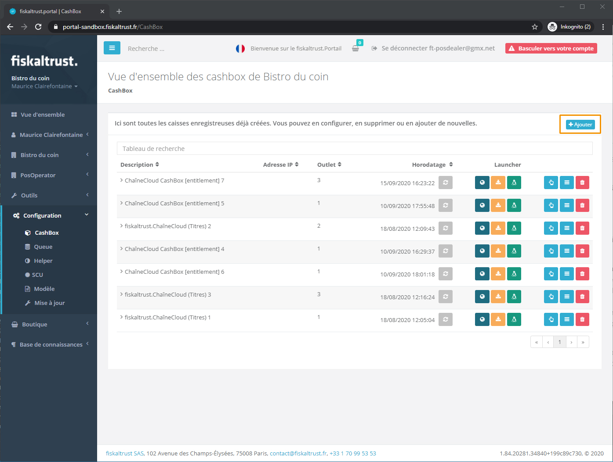

Dans la commande _CashBox_ du menu _Configuration_, vous devez cliquer sur le bouton _Ajouter_.

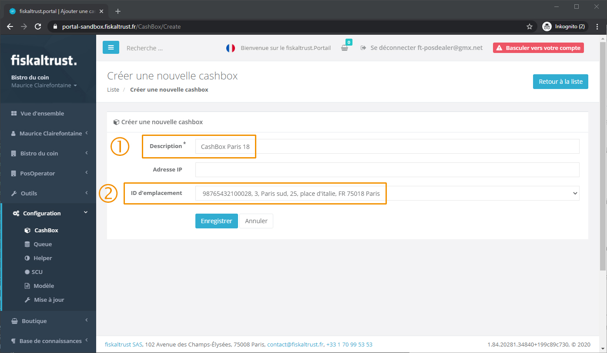

Entrez une _description_ **1** et sélectionnez à nouveau le même établissement **2** que dans les étapes précédentes. Après avoir cliqué sur _Enregistrer_, vous trouverez une nouvelle CashBox dans la liste.

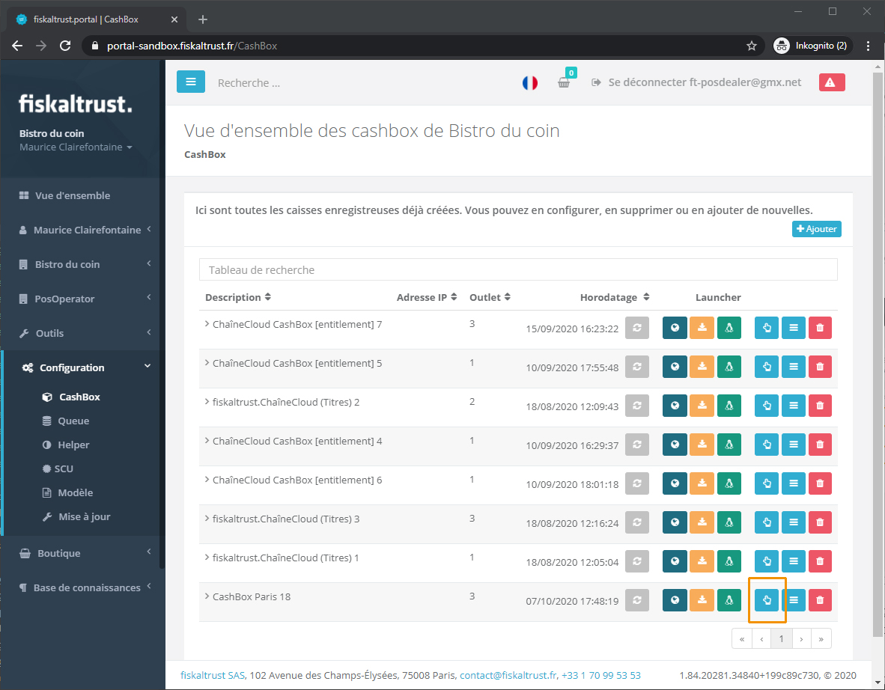

Cliquez sur le bouton avec le symbole de la main.

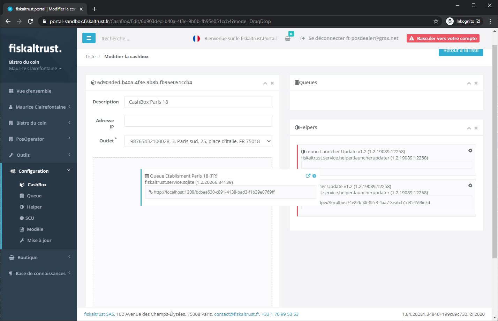

Faites maintenant glisser la queue récemment créée de la droite vers la gauche. Vérifiez que le bon établissement est sélectionné et cliquez sur _Enregistrer_ en bas de la page.

### Créer une configuration

Après chaque modification de la CashBox, vous devez concilier les modifications apportées avec la configuration existante.

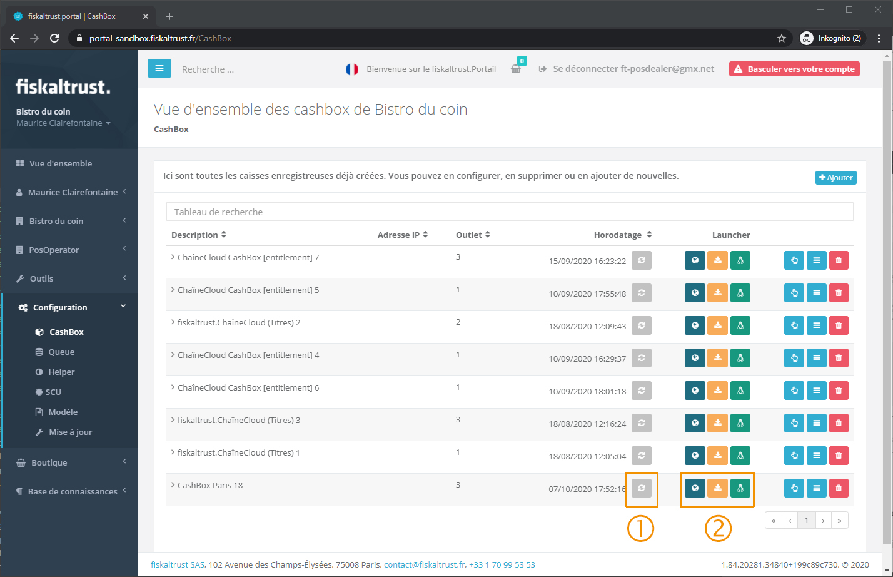

Cliquez sur le bouton *Rebuild Configuration* (flèches circulaires) **1** dans la ligne CashBox.
Vous pouvez maintenant télécharger l'un des trois launchers **2** et installer le fiskaltrust.Middleware sur votre POS-System en local.
